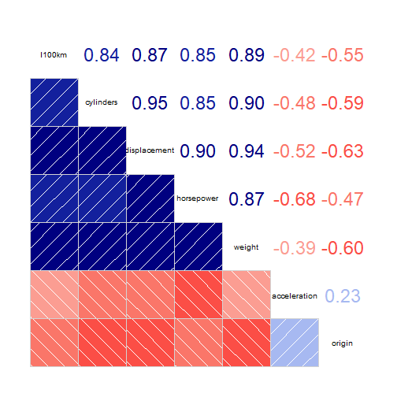
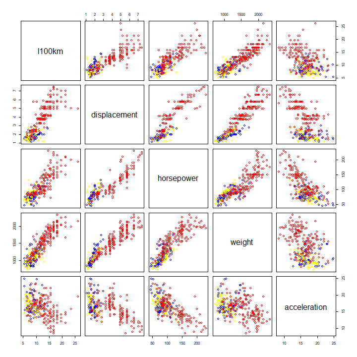
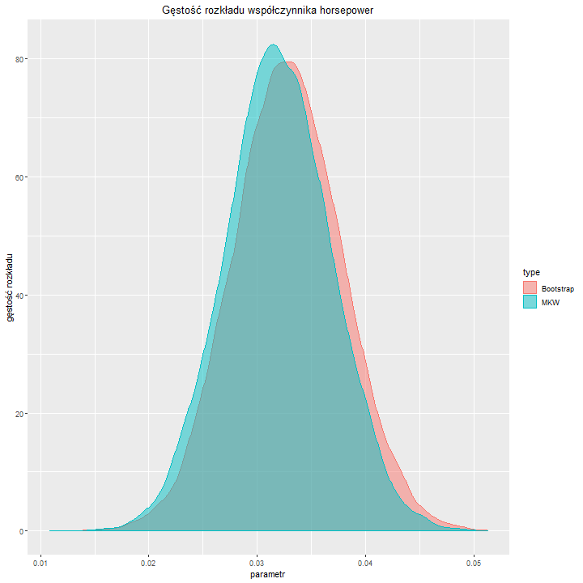
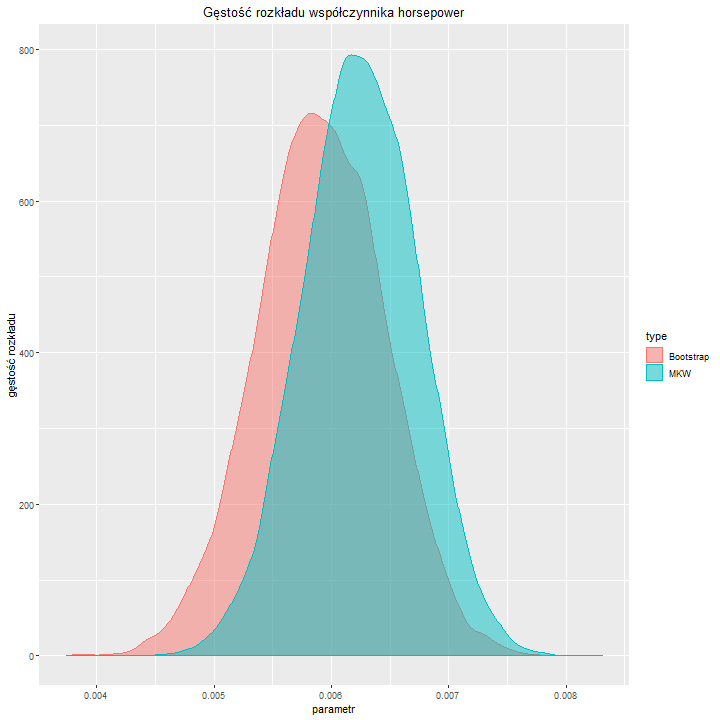

<style>
.reveal h1, .reveal h2, .reveal h3 {
  word-wrap: normal;
  -moz-hyphens: none;
}
.reveal .slides>section {
    overflow-y: scroll;
}
.small-code pre code {
  font-size: 1em;
}
.reveal h1, .reveal h2, .reveal h3, .reveal h4, .reveal h5, .reveal h6 {
    font-family: "Roboto", Impact, sans-serif;
}
.reveal p {
    text-align: justify;
}
.midcenter {
    position: fixed;
    top: 50%;
    left: 50%;
}
.footer {
    color: black; background: #E8E8E8;
    position: fixed; top: 90%;
    text-align:center; width:100%;
}
.pinky .reveal .state-background {
  background: #FF69B4;
} 
.pinky .reveal h1,
.pinky .reveal h2,
.pinky .reveal p {
  color: black;
}
pre {
  max-height: 400px;
  overflow-y: auto;
}

pre.r {
  max-height: none;
}
.reveal pre code {
    font-size: 1.4em;
}
</style>

Projekt Poprawkowy - Metody Nieparametryczne
========================================================
author: Antoni Baum, Paweł Sumara
autosize: true


Wprowadzenie
========================================================

Celem projektu jest budowa modelu liniowego dla spalania w podanych danych. Aby otrzymać model, użyte zostaną zarówno klasyczne metody ekonometryczne, jak i metody bootstrapowe.

Przyjęto poziom istotności α = 5%.

Zmienne
========================================================
Zmienna objaśniana

- **l100km** - spalanie w litrach na 100 kilometrów.

Zmienne objaśniające

- **cylinders** - liczba cylindrów,
- **displacement** - objętość silnika w litrach,
- **horsepower** - moc w koniach mechanicznych,
- **weight** - waga w kilogramach,
- **acceleration** - czas przyspieszenia od 0 do 100 kilometrów na godzinę, podany w sekundach,
- **year** - rok produkcji (19##),
- **origin** - miejsce produkcji (1 - USA, 2 - Europa, 3 - Japonia),
- **name** - nazwa samochodu.

Format danych
========================================================

Dane w pliku `cars.csv` zostały przekształcone na jednostki metryczne za pomocą biblioteki `units`.

```r
dat = read.csv("cars.csv", header = TRUE)

gallon = as_units("gallon")
dat$mpg = dat$mpg * with(ud_units, mi/gallon)
units(dat$mpg) = with(ud_units, l/km)
dat$mpg = dat$mpg*100
colnames(dat)[1] = "l100km"

dat$displacement = dat$displacement * ud_units[["in"]]^3
units(dat$displacement) = with(ud_units, l)

dat$weight = dat$weight * with(ud_units, lb)
units(dat$weight) = with(ud_units, kg)

dat$acceleration = dat$acceleration * 1.05

dat = drop_units(dat) #po przekształceniu jednostki nie są już potrzebne, oraz mogą powodować błędy
dat = dat[order(dat$l100km),]

origin_colors = c('red','blue','yellow') #USA - czerwony, Europa - niebieski, Japonia - żółty
```

Format danych
========================================================

<table class="table" style="margin-left: auto; margin-right: auto;">
 <thead>
  <tr>
   <th style="text-align:left;">   </th>
   <th style="text-align:right;"> l100km </th>
   <th style="text-align:right;"> cylinders </th>
   <th style="text-align:right;"> displacement </th>
   <th style="text-align:right;"> horsepower </th>
   <th style="text-align:right;"> weight </th>
   <th style="text-align:right;"> acceleration </th>
   <th style="text-align:right;"> year </th>
   <th style="text-align:right;"> origin </th>
   <th style="text-align:left;"> name </th>
  </tr>
 </thead>
<tbody>
  <tr>
   <td style="text-align:left;"> 80 </td>
   <td style="text-align:right;"> 5.047523 </td>
   <td style="text-align:right;"> 4 </td>
   <td style="text-align:right;"> 1.409288 </td>
   <td style="text-align:right;"> 65 </td>
   <td style="text-align:right;"> 957.0799 </td>
   <td style="text-align:right;"> 18.795 </td>
   <td style="text-align:right;"> 80 </td>
   <td style="text-align:right;"> 3 </td>
   <td style="text-align:left;"> mazda glc </td>
  </tr>
  <tr>
   <td style="text-align:left;"> 277 </td>
   <td style="text-align:right;"> 5.273870 </td>
   <td style="text-align:right;"> 4 </td>
   <td style="text-align:right;"> 1.491223 </td>
   <td style="text-align:right;"> 67 </td>
   <td style="text-align:right;"> 839.1459 </td>
   <td style="text-align:right;"> 14.490 </td>
   <td style="text-align:right;"> 80 </td>
   <td style="text-align:right;"> 3 </td>
   <td style="text-align:left;"> honda civic 1500 gl </td>
  </tr>
  <tr>
   <td style="text-align:left;"> 292 </td>
   <td style="text-align:right;"> 5.419691 </td>
   <td style="text-align:right;"> 4 </td>
   <td style="text-align:right;"> 1.474836 </td>
   <td style="text-align:right;"> 48 </td>
   <td style="text-align:right;"> 1059.1382 </td>
   <td style="text-align:right;"> 24.885 </td>
   <td style="text-align:right;"> 80 </td>
   <td style="text-align:right;"> 2 </td>
   <td style="text-align:left;"> vw dasher (diesel) </td>
  </tr>
  <tr>
   <td style="text-align:left;"> 115 </td>
   <td style="text-align:right;"> 5.457415 </td>
   <td style="text-align:right;"> 4 </td>
   <td style="text-align:right;"> 1.474836 </td>
   <td style="text-align:right;"> 48 </td>
   <td style="text-align:right;"> 900.3809 </td>
   <td style="text-align:right;"> 22.575 </td>
   <td style="text-align:right;"> 78 </td>
   <td style="text-align:right;"> 2 </td>
   <td style="text-align:left;"> volkswagen rabbit custom diesel </td>
  </tr>
  <tr>
   <td style="text-align:left;"> 192 </td>
   <td style="text-align:right;"> 5.667822 </td>
   <td style="text-align:right;"> 4 </td>
   <td style="text-align:right;"> 1.605932 </td>
   <td style="text-align:right;"> 76 </td>
   <td style="text-align:right;"> 972.5020 </td>
   <td style="text-align:right;"> 15.435 </td>
   <td style="text-align:right;"> 80 </td>
   <td style="text-align:right;"> 2 </td>
   <td style="text-align:left;"> vw rabbit </td>
  </tr>
</tbody>
</table>

Hipotezy
========================================================
Na samym początku można załozyć, że nazwa samochodu nie będzie miała wpływu na spalanie. Z tego też powodu, odrzucono zmienną **name**.

Najprawdopodobniej, ilość spalanego paliwa będzie wprost proporcjonalna do wagi (im cięższy samochód, tym większe spalanie), liczby cylindrów, objętości silnika, mocy, przyspieszenia (im większe, tym większe spalanie), a rok produkcji będzie odwrotnie proporcjonlany - wraz z postępem technicznym, silniki powinny być bardziej wydajne.

Hipotezy
========================================================
- Ilość spalanego paliwa jest odwrotnie proporcjonalna do roku produkcji.
- Ilość spalanego paliwa jest wprost proporcjonalna do wagi.
- Ilość spalanego paliwa jest wprost proporcjonalna do liczby cylindrów.
- Ilość spalanego paliwa jest wprost proporcjonalna do objętości silnika.
- Ilość spalanego paliwa jest wprost proporcjonalna do mocy (**horsepower**).
- Ilość spalanego paliwa jest wprost proporcjonalna do przyspieszenia.


Statystyki opisowe
========================================================
<table class="table" style="margin-left: auto; margin-right: auto;">
 <thead>
  <tr>
   <th style="text-align:left;">   </th>
   <th style="text-align:right;"> Mean </th>
   <th style="text-align:right;"> Median </th>
   <th style="text-align:right;"> Min. </th>
   <th style="text-align:right;"> Max. </th>
   <th style="text-align:right;"> Std. dev. </th>
   <th style="text-align:right;"> CV </th>
  </tr>
 </thead>
<tbody>
  <tr>
   <td style="text-align:left;"> l100km </td>
   <td style="text-align:right;"> 11.219371 </td>
   <td style="text-align:right;"> 10.226722 </td>
   <td style="text-align:right;"> 5.047523 </td>
   <td style="text-align:right;"> 26.134955 </td>
   <td style="text-align:right;"> 3.9091189 </td>
   <td style="text-align:right;"> 0.3484259 </td>
  </tr>
  <tr>
   <td style="text-align:left;"> cylinders </td>
   <td style="text-align:right;"> 5.490446 </td>
   <td style="text-align:right;"> 4.000000 </td>
   <td style="text-align:right;"> 3.000000 </td>
   <td style="text-align:right;"> 8.000000 </td>
   <td style="text-align:right;"> 1.7111468 </td>
   <td style="text-align:right;"> 0.3116590 </td>
  </tr>
  <tr>
   <td style="text-align:left;"> displacement </td>
   <td style="text-align:right;"> 3.182978 </td>
   <td style="text-align:right;"> 2.474447 </td>
   <td style="text-align:right;"> 1.114320 </td>
   <td style="text-align:right;"> 7.456114 </td>
   <td style="text-align:right;"> 1.7205287 </td>
   <td style="text-align:right;"> 0.5405405 </td>
  </tr>
  <tr>
   <td style="text-align:left;"> horsepower </td>
   <td style="text-align:right;"> 104.598726 </td>
   <td style="text-align:right;"> 95.000000 </td>
   <td style="text-align:right;"> 46.000000 </td>
   <td style="text-align:right;"> 230.000000 </td>
   <td style="text-align:right;"> 38.1476633 </td>
   <td style="text-align:right;"> 0.3647049 </td>
  </tr>
  <tr>
   <td style="text-align:left;"> weight </td>
   <td style="text-align:right;"> 1349.139721 </td>
   <td style="text-align:right;"> 1270.512228 </td>
   <td style="text-align:right;"> 731.644493 </td>
   <td style="text-align:right;"> 2331.464782 </td>
   <td style="text-align:right;"> 389.8955852 </td>
   <td style="text-align:right;"> 0.2889957 </td>
  </tr>
  <tr>
   <td style="text-align:left;"> acceleration </td>
   <td style="text-align:right;"> 16.263296 </td>
   <td style="text-align:right;"> 16.275000 </td>
   <td style="text-align:right;"> 8.400000 </td>
   <td style="text-align:right;"> 24.885000 </td>
   <td style="text-align:right;"> 2.8714069 </td>
   <td style="text-align:right;"> 0.1765575 </td>
  </tr>
  <tr>
   <td style="text-align:left;"> year </td>
   <td style="text-align:right;"> 75.984076 </td>
   <td style="text-align:right;"> 76.000000 </td>
   <td style="text-align:right;"> 70.000000 </td>
   <td style="text-align:right;"> 82.000000 </td>
   <td style="text-align:right;"> 3.6276011 </td>
   <td style="text-align:right;"> 0.0477416 </td>
  </tr>
  <tr>
   <td style="text-align:left;"> origin </td>
   <td style="text-align:right;"> 1.608280 </td>
   <td style="text-align:right;"> 1.000000 </td>
   <td style="text-align:right;"> 1.000000 </td>
   <td style="text-align:right;"> 3.000000 </td>
   <td style="text-align:right;"> 0.8206957 </td>
   <td style="text-align:right;"> 0.5102940 </td>
  </tr>
</tbody>
</table>
Jeżeli współczynnik zmienności przyjmuje wartość mniejszą lub równą 0,1, zmienną traktuje się
jako stałą i wyłącza z modelu. Najmniejszy współczynnik zmienności ma zmienna **year** (0.048). Zmienna objaśniana (**l100km**) zawiera się w przedziale [5.05; 26.13], z medianą równą 10.23 i średnią równa 11.22.

Z powodu podanego powyżej, odrzucono zmienną **year**.


Macierz korelacji
========================================================

Zmienne objaśniające **cylinders** oraz **displacement** są najbardziej skorelowane ze sobą (0.95).
Ponadto, zmienna **displacement** jest silnie skorelowana z zmiennymi **weight** oraz
**horsepower**. Wysoka korelacja pomiędzy zmiennymi objaśniającymi jest
zjawiskiem niepożądanym, prowadzącym do zawyżenia współczynnika determinacji. Jednakże, ponieważ zmienna **displacement** ma prawie dwukrotnie wyższy współczynnik determinacji niż zmienna **cylinders**, podjęto decyzję o usunięciu **cylinders**.

Zmienna objaśniana jest najsilniej skorelowana ze zmienną **weight**.

Można również zobaczyć, że hipotezy postawione wcześniej są zgodne z wynikami.


Analiza wizualna korelacji
========================================================

USA - czerwony, Europa - niebieski, Japonia - żółty.

Zmienna **acceleration** jest znacznie rozrzucona względem zmiennej objaśnianej - nie jest widoczny trend, jak dla pozostałych zmiennych. Z tego też powodu, zmienna **acceleration** zostaje odrzucona.


Zmienne po selekcji
========================================================
Zmienna objaśniana

- **l100km** - spalanie w litrach na 100 kilometrów.

Zmienne objaśniające

- **displacement** - objętość silnika w litrach,
- **horsepower** - moc w koniach mechanicznych,
- **weight** - waga w kilogramach,
- **origin** - miejsce produkcji (1 - USA, 2 - Europa, 3 - Japonia).

Model liniowy MNK
========================================================

```

Call:
lm(formula = l100km ~ ., data = dat)

Residuals:
    Min      1Q  Median      3Q     Max 
-4.5857 -0.9867 -0.0048  0.8858  7.2345 

Coefficients:
               Estimate Std. Error t value Pr(>|t|)    
(Intercept)   0.1799060  0.6359595   0.283    0.777    
displacement  0.0373253  0.1863395   0.200    0.841    
horsepower    0.0322768  0.0058326   5.534 6.69e-08 ***
weight        0.0058233  0.0006973   8.351 2.30e-15 ***
origin       -0.1939215  0.1527170  -1.270    0.205    
---
Signif. codes:  0 '***' 0.001 '**' 0.01 '*' 0.05 '.' 0.1 ' ' 1

Residual standard error: 1.644 on 309 degrees of freedom
Multiple R-squared:  0.8254,	Adjusted R-squared:  0.8232 
F-statistic: 365.3 on 4 and 309 DF,  p-value: < 2.2e-16
```
Model uzyskany metodą najmniejszych kwadratów ze wszystkich zmiennych po wstępnej selekcji ma duży współczynnik R-kwadrat (83%), co wskazuje na duże dopasowanie modelu do danych. Jednakże, zmienne **displacement** i **origin** mają duże p-value, co wskazuje na ich małą istotność statystyczną. Aby pozbyć się nieistotnych zmiennych, użyta zostanie metoda krokowa wstecz.

Metoda krokowa wstecz
========================================================

```

Call:
lm(formula = l100km ~ ., data = dat[, !(names(dat) %in% c("displacement"))])

Residuals:
    Min      1Q  Median      3Q     Max 
-4.5274 -0.9942 -0.0005  0.8829  7.1704 

Coefficients:
              Estimate Std. Error t value Pr(>|t|)    
(Intercept)  0.1320531  0.5884703   0.224    0.823    
horsepower   0.0328861  0.0049687   6.619 1.59e-10 ***
weight       0.0059122  0.0005368  11.013  < 2e-16 ***
origin      -0.2045331  0.1430120  -1.430    0.154    
---
Signif. codes:  0 '***' 0.001 '**' 0.01 '*' 0.05 '.' 0.1 ' ' 1

Residual standard error: 1.641 on 310 degrees of freedom
Multiple R-squared:  0.8254,	Adjusted R-squared:  0.8237 
F-statistic: 488.6 on 3 and 310 DF,  p-value: < 2.2e-16
```

Metoda krokowa wstecz
========================================================

```

Call:
lm(formula = l100km ~ ., data = dat[, !(names(dat) %in% c("displacement", 
    "origin"))])

Residuals:
    Min      1Q  Median      3Q     Max 
-4.7199 -0.9855  0.0346  0.8493  7.1063 

Coefficients:
              Estimate Std. Error t value Pr(>|t|)    
(Intercept) -0.5570380  0.3384227  -1.646    0.101    
horsepower   0.0319728  0.0049358   6.478 3.64e-10 ***
weight       0.0062500  0.0004829  12.942  < 2e-16 ***
---
Signif. codes:  0 '***' 0.001 '**' 0.01 '*' 0.05 '.' 0.1 ' ' 1

Residual standard error: 1.644 on 311 degrees of freedom
Multiple R-squared:  0.8243,	Adjusted R-squared:  0.8231 
F-statistic: 729.4 on 2 and 311 DF,  p-value: < 2.2e-16
```
Po usunięciu wszystkich nieistotnych zmiennych, w modelu pozostały zmienne **horsepower** oraz **weight**. Współczynnik R-kwadrat utrzymał się na tym samym poziomie co przed zastosowaniem metody krokowej wstecz (83%). Skorygowany R-kwadrat jest prawie identyczny, co wskazuje na brak zjawiska przeparametryzowania modelu.

Diagnostyka modelu
========================================================
Test normalności rozkładu reszt

```

	Shapiro-Wilk normality test

data:  model$residuals
W = 0.97815, p-value = 0.0001022

	Anderson-Darling normality test

data:  model$residuals
A = 1.2299, p-value = 0.003292
```
Wartości p testów Shapiro-Wilka i Andersona-Darlinga są niższe niż przyjęty poziom istotności (0.05). Nie ma podstaw do odrzucenia hipotezy zerowej o normalności rozkładu reszt. Rozkład reszt nie jest rozkładem normalnym.

Diagnostyka modelu
========================================================
Badanie isototności zmiennych objaśniających

```
Wald test

Model 1: l100km ~ horsepower + weight
Model 2: l100km ~ 1
  Res.Df Df      F    Pr(>F)    
1    311                        
2    313 -2 729.39 < 2.2e-16 ***
---
Signif. codes:  0 '***' 0.001 '**' 0.01 '*' 0.05 '.' 0.1 ' ' 1
```
Wartość p testu nie daje podstaw do odrzucenia hipotezy zerowej - wszystkie zmienne objaśniające są istotne.

Diagnostyka modelu
========================================================
Test Ramseya RESET - służy do zbadania losowości próby, oraz poprawności postaci analitycznej
modelu. Jeśli hipoteza zerowa jest spełniona, dobór jednostek jest losowy, oraz model jest
poprawnej postaci.

```

	RESET test

data:  model
RESET = 1.945, df1 = 2, df2 = 309, p-value = 0.1447
```
Wartość p testu przekracza przyjęty poziom istotności (0.05), co umożliwia przyjęcie hipotezy zerowej.

Diagnostyka modelu
========================================================
Badanie heteroskedastyczności - test Breusha-Pagana.

```

	studentized Breusch-Pagan test

data:  model
BP = 15.475, df = 2, p-value = 0.0004361
```
Heteroskedastyczność to nieporządana sytuacja, gdy przynajmniej jedna zmienna losowa z ciągu różni się od innych wariancją lub jej wariancja jest nieskończona.

Wartość p testu nie przekracza przyjętego poziom istotności (0.05), co oznacza, że w modelu występuje heteroskedastyczność.

Metoda bootstrapowa
========================================================
Bootstrapping - dowolny test lub dane, które polegają na losowym próbkowaniu ze zwracaniem. Bootstrapping pozwala na przypisnie miar dokładności do próbnych oszacowań. Bootstrapping umożliwia oszacowanie rozkładu próbek większości statystyk przy użyciu losowych metod próbkowania.


```

Summary of Bootstrapping the 'stepAIC()' procedure for

Call:
lm(formula = l100km ~ ., data = dat)

Bootstrap samples: 10000 
Direction: backward 
Penalty: 2 * df

Covariates selected
                (%)
weight       100.00
horsepower    99.54
origin        46.02
displacement  37.92

Coefficients Sign
              + (%) - (%)
horsepower   100.00  0.00
weight       100.00  0.00
displacement  67.91 32.09
origin         0.28 99.72

Stat Significance
                (%)
weight       100.00
horsepower    98.97
displacement  61.45
origin        53.93


The stepAIC() for the original data-set gave

Call:
lm(formula = l100km ~ horsepower + weight + origin, data = dat)

Coefficients:
(Intercept)   horsepower       weight       origin  
   0.132053     0.032886     0.005912    -0.204533  


Stepwise Model Path 
Analysis of Deviance Table

Initial Model:
l100km ~ displacement + horsepower + weight + origin

Final Model:
l100km ~ horsepower + weight + origin

            Step Df  Deviance Resid. Df Resid. Dev      AIC
1                                   309   834.8919 317.0635
2 - displacement  1 0.1084098       310   835.0003 315.1043
```
Po oszacowaniu, do modelu weszły zmienne **horsepower**, **weight** oraz **origin**.

Model liniowy bootstrapowy
========================================================

```

Call:
lm(formula = l100km ~ horsepower + weight + origin, data = dat)

Residuals:
    Min      1Q  Median      3Q     Max 
-4.5274 -0.9942 -0.0005  0.8829  7.1704 

Coefficients:
              Estimate Std. Error t value Pr(>|t|)    
(Intercept)  0.1320531  0.5884703   0.224    0.823    
horsepower   0.0328861  0.0049687   6.619 1.59e-10 ***
weight       0.0059122  0.0005368  11.013  < 2e-16 ***
origin      -0.2045331  0.1430120  -1.430    0.154    
---
Signif. codes:  0 '***' 0.001 '**' 0.01 '*' 0.05 '.' 0.1 ' ' 1

Residual standard error: 1.641 on 310 degrees of freedom
Multiple R-squared:  0.8254,	Adjusted R-squared:  0.8237 
F-statistic: 488.6 on 3 and 310 DF,  p-value: < 2.2e-16
```
Uzyskany model jest podobny (włącznie ze współczynnikiem determinacji) do modelu uzyskanego metodą krokową wstecz - jedyną różnicą jest zamieszczenie w nim zmiennej **origin**. Jej wartość p wskazuje na małą istotność statystyczną, i dlatego też została ona odrzucona podczas metody krokowej wstecz.

Porównanie przedziałów ufności
========================================================

Przedziały ufności dla modelu uzyskanego metodą krokową wstecz:
<table class="table" style="margin-left: auto; margin-right: auto;">
 <thead>
  <tr>
   <th style="text-align:left;">   </th>
   <th style="text-align:right;"> const </th>
   <th style="text-align:right;"> horsepower </th>
   <th style="text-align:right;"> weight </th>
  </tr>
 </thead>
<tbody>
  <tr>
   <td style="text-align:left;"> L </td>
   <td style="text-align:right;"> -1.2203342 </td>
   <td style="text-align:right;"> 0.0222989 </td>
   <td style="text-align:right;"> 0.0053035 </td>
  </tr>
  <tr>
   <td style="text-align:left;"> R </td>
   <td style="text-align:right;"> 0.1062582 </td>
   <td style="text-align:right;"> 0.0416467 </td>
   <td style="text-align:right;"> 0.0071965 </td>
  </tr>
  <tr>
   <td style="text-align:left;"> Width </td>
   <td style="text-align:right;"> 1.3265925 </td>
   <td style="text-align:right;"> 0.0193479 </td>
   <td style="text-align:right;"> 0.0018930 </td>
  </tr>
</tbody>
</table>

Przedziały ufności dla modelu uzyskanego metodą bootstrapową:
<table class="table" style="margin-left: auto; margin-right: auto;">
 <thead>
  <tr>
   <th style="text-align:left;">   </th>
   <th style="text-align:right;"> const </th>
   <th style="text-align:right;"> horsepower </th>
   <th style="text-align:right;"> weight </th>
   <th style="text-align:right;"> origin </th>
  </tr>
 </thead>
<tbody>
  <tr>
   <td style="text-align:left;"> L </td>
   <td style="text-align:right;"> -1.021327 </td>
   <td style="text-align:right;"> 0.0231476 </td>
   <td style="text-align:right;"> 0.0048600 </td>
   <td style="text-align:right;"> -0.4848315 </td>
  </tr>
  <tr>
   <td style="text-align:left;"> R </td>
   <td style="text-align:right;"> 1.285434 </td>
   <td style="text-align:right;"> 0.0426246 </td>
   <td style="text-align:right;"> 0.0069644 </td>
   <td style="text-align:right;"> 0.0757652 </td>
  </tr>
  <tr>
   <td style="text-align:left;"> Width </td>
   <td style="text-align:right;"> 2.306761 </td>
   <td style="text-align:right;"> 0.0194770 </td>
   <td style="text-align:right;"> 0.0021044 </td>
   <td style="text-align:right;"> 0.5605966 </td>
  </tr>
</tbody>
</table>

Można zaobserwować, że przedziały ufności współczynników **horsepower** oraz **weight** nie różnią się znacznie.

Wykres rozkładu współczynnika horsepower
========================================================

Przedziały ufności nie różnią się istotnie szerokością.

Wykres rozkładu współczynnika weight
========================================================

Przedziały ufności są przesunięte między sobą, oraz nie różnią się istotnie szerokością.

Podsumowanie
========================================================
Zarówno model uzyskany metodą krokową wstecz, jak i metodą bootstrapową, dobrze opisuje zjawisko spalania. Ich współczynniki determinacji or szerokości rozkładów reszt nie różnią się istotnie. Model uzyskany metodą krokową wstecz nie spełnia warunku homoskedastyczności, co może być jednak skorygowane poprzez odpowiednie przekształcenia.
